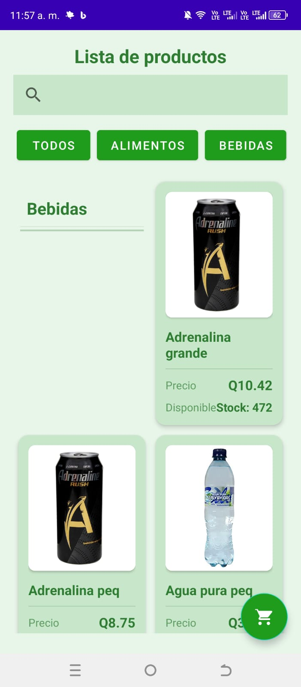
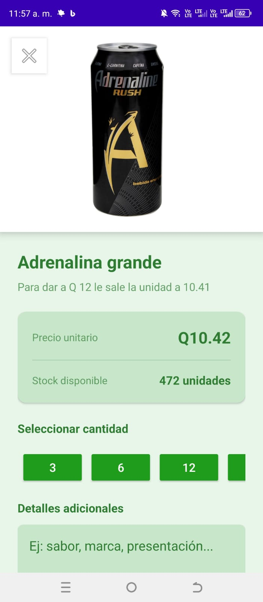
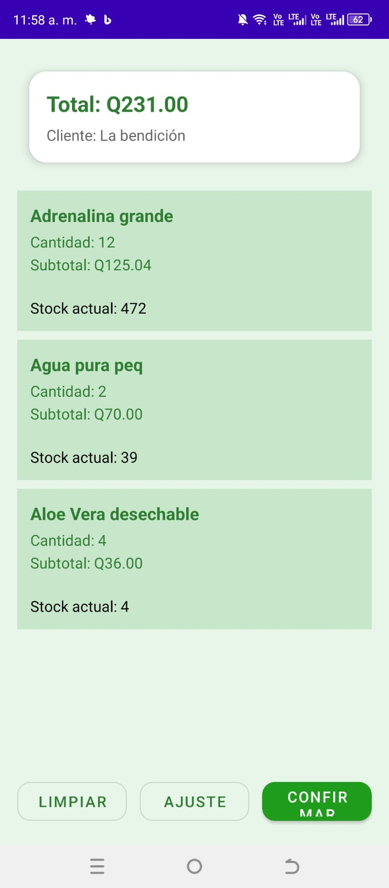
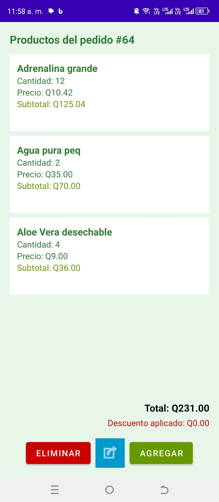
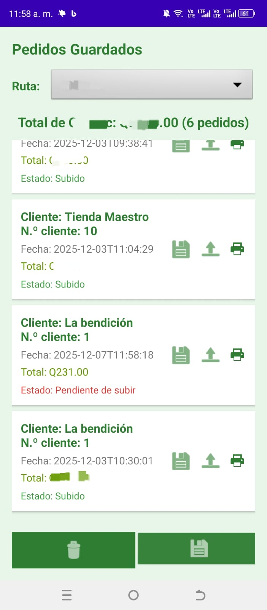

#  Distribuidora Jireh — Sistema de Ventas (Android + Firestore + Room)

**Aplicación móvil empresarial** desarrollada para la gestión de ventas, control de inventario y registro de pedidos en tiempo real.

Este proyecto combina **arquitectura moderna de Android**, soporte **offline-first**, sincronización con **Firestore** y un flujo de ventas completo diseñado para uso diario en campo.

---

##  Tecnologías principales

* **Kotlin**
* **MVVM + Clean Architecture**
* **Coroutines + Flow**
* **Room (offline data)**
* **Firestore (online sync)**
* **RecyclerView + ListAdapter + DiffUtil**
* **Material Design**
* **LiveData / StateFlow**
* **Dependency Injection**
* **Firebase Authentication**

---

##  Capturas de pantalla

<p align="center">
  
  
  
  
  
</p>

<p align="center">
  ↓
</p>

**Data Source (Remote + Local)**

Esta arquitectura garantiza:

* Bajo acoplamiento  
* Facilidad para testear  
* Escalabilidad  
* Reemplazar Firestore por otra fuente sin tocar la UI  

---

##  Funcionalidades principales

###  Control de inventario

* Listado de productos en tiempo real  
* Búsquedas, filtros, actualización de stock  
* Sincronización automática online/offline  

###  Gestión de ventas

* Carrito de compras avanzado  
* Cálculo de totales, descuentos, cantidades  
* Validación de inventario  
* Confirmación de compra con persistencia  

###  Sincronización con Firestore

* Lectura y escritura en la nube  
* Suscripciones en tiempo real con **callbackFlow**  
* Repositorio independiente de la UI  

###  Soporte completo offline

* Base de datos Room  
* Operaciones funcionando sin internet  
* Sincronización cuando la conexión regresa  

---

##  Estructura del Proyecto

```
data/
   repositories/
   datasources/
   models/
domain/
   usecases/
ui/
   carrito/
   productos/
   pedidos/
common/
   utils/
```

---

## Puntos fuertes del proyecto

* Migración completa a repositorios desacoplados (Firestore → Repository → ViewModel → UI)
* Uso avanzado de ListAdapter + DiffUtil
* Validación de negocio fuera de la UI
* Manejo de corrutinas para procesos críticos
* Separación estricta de lógica y presentación
* Documentación clara y modular
* Casos reales de optimización (400+ productos, carga rápida, sin bloqueos)

---

##  Nota sobre el código fuente

Este proyecto es **comercial**, por lo que no puedo publicar el código completo.
Sin embargo, he incluido:

* Adaptadores (CarritoAdapter)
* Repositorios limpios (FirestoreProductosRepository / FirestoreCarritoRepository)
* Actividades refactorizadas (VerCarritoActivity)
* Modelos y estructuras suficientes para evaluar mis habilidades

El resto del código puede ser compartido de forma privada para procesos de reclutamiento.

---

##  Qué aprendí construyendo este sistema

* Implementación real de arquitectura profesional en Android
* Sincronización cloud/local sin bloquear la UI
* Diseño de un sistema de ventas real usado a diario
* Refactor de un proyecto completo hacia buenas prácticas
* DDD simplificado aplicado a apps móviles
* Separación lógica de negocio → reglas claras y mantenibles

---

##  Contacto

Si deseas ver partes adicionales del código o tienes alguna duda técnica:

**Anderson Aguirre**
Email: andersonaguirre794@gmail.com
GitHub: https://github.com/imanderrrrr


=======
# SalesApp-Android-Kotlin
Sistema móvil de ventas e inventario con Kotlin, Firestore y Room. Arquitectura limpia, carrito de compras, flujo completo de pedidos y sincronización offline-first.
>>>>>>> 1c11cb64d6cd8c38614f804980570c7cb6de0dd3
